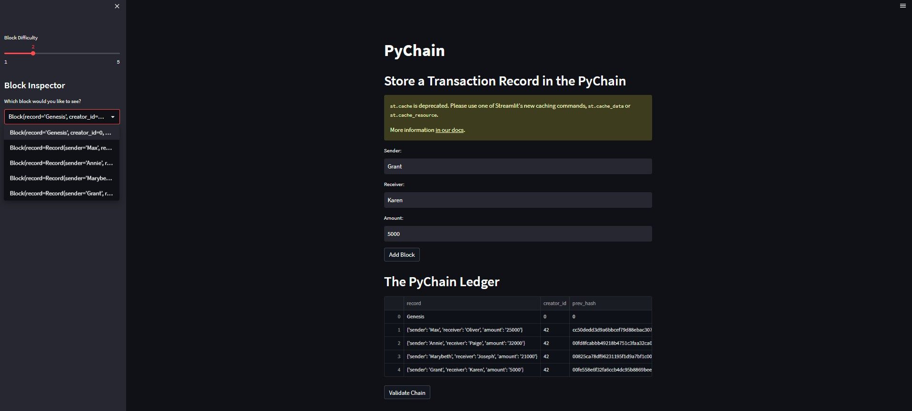
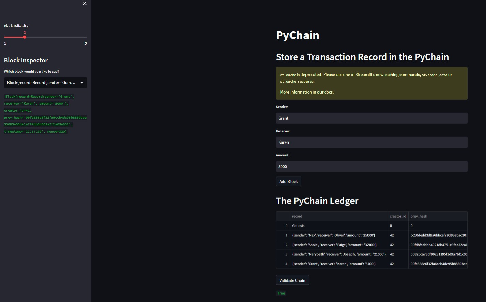

# Module_18_Challenge

This is a blockchain-based ledger system that allows clients to conduct financial transactions and verify the integrity of the data in the ledger. The application utilizes Streamlit to create a user-friendly web interface. 

---

## Technologies

This project levereges python 3.9 with the following packages:

* [Streamlit](https://streamlit.io/)
* [Pandas](https://pandas.pydata.org/)
* [Dataclasses](https://docs.python.org/3/library/dataclasses.html) 
* [Hashlib](https://docs.python.org/3/library/hashlib.html)
* [Typing](https://docs.python.org/3.6/library/typing.html) 
* [Datetime](https://docs.python.org/3/library/datetime.html)

---

## Usage

To use the application clone the repository, open up a new terminal, navigate to the respective folder, and run the Streamlit application by using: `streamlit run pychain.py`

---

## Streamlit Screenshots

**Verification**

**Successful Test**

---

## Contributors

Created by Maximus Accurso

---

## License

None
